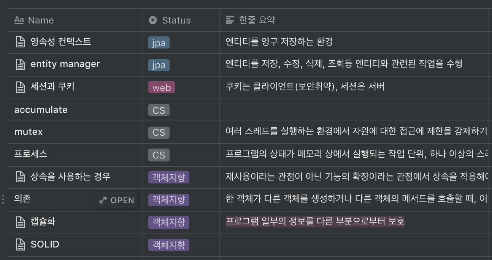

# 나에게 맞는 학습 방법을 찾아서

 

# 학습 태도의 변화

내 인생에서 학습 방식의 변화는 `학원 → 자기주도학습 → 효율적인 학습 방법` 이렇게 3단계로 나뉜다.

 

### 공부와는 거리가 멀었던 나

작년까지만 해도 나는 공부에 흥미도 없고, 공부가 필요할 때면 학원부터 등록했다. 물론 독학은 해 본 적도 없었다. 

 

### 해보니까 재미있네? 근데 결과는 음..

작년 9월, 프로그래밍을 다시 시작했다. 이번에도 역시 `패스트캠퍼스`라는 학원부터 등록했고 별 생각 없이 갔다. 

막상 가보니 열정적인 주변의 분위기는 프로그래밍을 재미있게 만들어줬고, 조금씩 잘하고 싶은 욕심이 생기기 시작했다. 그 무렵 선생님께서 '프로그래머는 자기주도학습이 중요하다'는 말을 해주셨다.

그 후로 모르는 문제가 생기면 혼자 해결하고, 새로운 내용도 혼자 공부하려고 노력했다. 그렇게 특별한 방식 없이 **무작정 했다.** 하지만 과정이 끝났을 때, 결과는 만족스럽지 못했다. 

나의 학습 방식에 문제가 있음을 그때 느낄 수 있었다. '이대로 취업을 해도 괜찮을까?' 걱정이 될 때 운이 좋게 우아한테코크스에 참여하게 되었고, 우아한테크코스가 끝났을 때는 '나만의 학습 방법을 찾자!' 라는 다짐을 하고 왔다.

 

### 효율적인 학습 방법

자기주도학습은 이제 익숙해졌으니 효율적인 학습 방법을 찾기 시작했다. 그중에서 남규진님이 작성하신 [학습에 실패한 이야기](http://woowabros.github.io/experience/2017/12/11/how-to-study.html) 가 가장 와 닿았다.

여기서 가장 공감되고 실천하기로 다짐한 다섯 가지가 있다.

- 일정 주기로 반복하기
- 편안한 학습법 X → 의식적인 연습 O
- 자신의 현재 능력을 살짝 넘어서는 작업을 지속해서 시도해야 한다.
- 학습 전에 명확하고 구체적인 목표를 가지고 진행한다.
- 약점을 고치려고 의식적으로 노력해야 한다.

 

# 어떠한 시도를 했는가?

### 나의 약점 3가지

- 설명을 잘하지 못한다.
- 공부했던 부분인데 기억을 못한다.
- 집중력이 떨어진다.

나는 위의 3가지를 개선하기 위한 방법을 위주로 시도해봤다.

 

### 용어 정리  (++)

'왜 설명을 못 할까?' 이런 문제로 고민할 때 잘생긴 브라운 코치가 조언해준 방식이다.

- 개념에 대해서 한 문장, 세 문장, 길게 설명할 수 있게 세 단계로 나눠서 정리한다.
- 한 문장으로 언제든지 대답할 수 있게 평소에 외우고 다닌다.
- 면접을 볼 때는 세 줄, 전체 설명으로 대답할 수 있어야 한다.

용어 정리는 내가 좋아하는 노션을 적극 활용해서 관리하고 있다. 

결과는 만족스럽지만, 귀찮아서 작성을 미룰 때가 많다. 다시 힘내자!

 

### 글쓰기 (+)

글을 잘 써야 말도 잘 한다는 말을 듣고 꾸준히 글을 쓰고자 블로그를 운영 중이다. 

블로그의 글은 다른 사람들이 본다는 압박감에 좀 더 자세하고 쉽게 설명하려고 한다. 그러다 보니 많은 공부가 되지만 그만큼 스트레스도 많이 받는다. 적정선을 찾는 것이 중요한데 아직은 이 부분이 많이 어렵다.

글쓰기 역시 좋은 공부 방법의 하나지만 글을 쓰는데 시간이 오래 걸려서 아직은 나에게 효율적이지 못하다. 하지만 앞으로 글을 쓰는 실력이 더 나아지면서 학습에도 많은 도움이 될 거라는 확신이 든다. 

 

### 발표 (?)

역시 말을 잘하려면 남들 앞에서 많이 말해보는 것이 최고지! 라는 생각으로 스터디에서도 최대한 발표하려고 노력해보고 우테코에서도 발표를 해봤다. 역시 효과는 좋았지만 준비하는 과정이 힘들다는 단점이 있다.

학습 효율은 글쎄..? 아직 모르겠다.

 

### 복습 주기표 (++)

공부 후 1번, 자기 전에 1번, 주말에 1번 이렇게 복습하려고 복습 주기표를 만들었다. 

이렇게 하려면 공부한 내용을 정리해야 하는 번거로움이 있지만, 그만큼 공부가 잘되고 나중에 다시 보면 또 새로운 관점에서 보면서 많은 공부가 된다.

- 한 번 복습할 때마다 이동시키는 트렐로

- 달력으로도 볼 수 있어서 언제 무엇을 공부했는지 알 수 있다.

 

### 무작정 책 읽기 (-)

- 책을 읽는 것은 항상 유익하다. 하지만 읽기만 하고 끝내면 그대로 함께 잊는다.
- 책을 읽고 나면 나만의 생각을 정리하던가 실습을 해야 좋다. (**아웃풋이 중요하다**)
- 현재 하는 것과 관련된 책을 읽을 때 효율이 높다.

 

### 역시 코딩할 때가 최고다. (+++)

- 아무리 좋은 글을 많이 읽어도 직접 해보지 않으면 온전한 내 것이 안 된다.
- 코딩하다가 모르는 부분이 있으면 그때그때 찾아서 공부하면 이해하기도, 기억에도 좋다.
- 제일 중요한 점은 **재미있다.**

 

### 시도해보고 싶은 방식

- 시간제한 두고 공부하기

    개학 전날 방학 숙제할 때 집중력이 극도로 올라가는 것처럼, 공부할 때도 나만의 미션을 걸어서 시간제한을 두고 해보는 시도를 해 볼 계획이다.

 

# 결론

다양한 학습 방식을 시도 해봤지만 여전히 정답은 모르겠다. 하지만 나름 나에게 맞는 방법 몇 가지는 찾은 거 같다. 

> 공부에는 왕도가 없다.

내가 찾은 해결책은 직접 해보고, 반복, 반복 또 반복하는 것이다.

- 보지만 말고 직접 타이핑하기
- 반복하기
- 공부한 내용 정리하고 복습하기
- 블로그에 글쓰기
